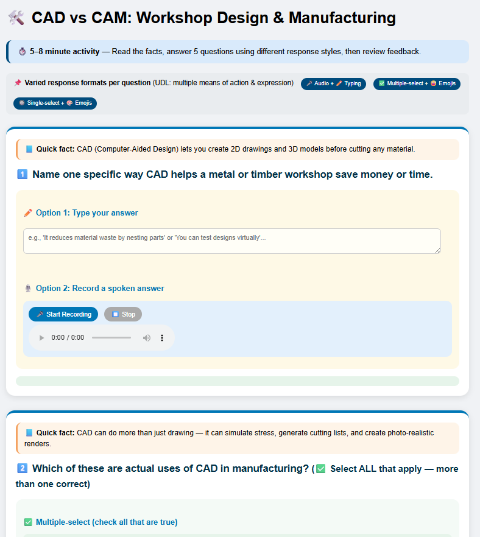
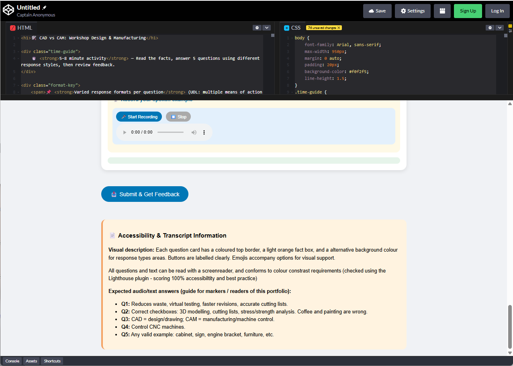

# Week 10

## Inclusive Digital Learning Resource

This digital learning resource is an introductory HTML quiz on CAD and CAM, designed for a Stage 4 (Years 7–8) Technology or Industrial Technology class studying metalwork or engineering before starting content of Computer Aided Design tools. The resource requires no accounts, or third party platforms — it can be run entirely offline in any web browser and was developed using HTML, CSS, and JavaScript, tested interactively in CodePen and validated locally.
The design explicitly demonstrates two Universal Design for Learning (UDL) principles (CAST, 2024). *Multiple Means of Representation* is evident through mini lesson facts, emojis, visual grouping of questions, and an accessible transcript. *Multiple Means of Action & Expression* is achieved by varying response formats across questions: some offer typed answers only, others use multiple select checkboxes, single select radios with emojis, or audio recording. This allows students to demonstrate understanding in ways that suit their literacy, language, or confidence levels.
Visual design follows WCAG 2.1 success criteria (colour contrast, focus indicators, consistent navigation). The quiz was audited using Lighthouse in Chrome DevTools, scoring 100% on Accessibility and Best Practices. Different background colours distinguish response types (e.g., mint for checkboxes, peach for radios, blue for audio panels), supporting cognitive load and scanability.

## AI Task

[AI Task Prompt and Response](week10b.html)

### Reflection on AI task

he AI-generated versions successfully adjust vocabulary and sentence complexity. The "younger" version uses analogies (e.g., "digital LEGO") and removes jargon, while the "technical" version introduces terms like post-processor and adaptive machining. However, this task revealed a fundamental misunderstanding: differentiating literacy level is not the same as applying Universal Design for Learning (UDL).

UDL's Multiple Means of Action & Expression is about offering response flexibility—audio, drawing, physical demonstration, selection—not just simpler words. My original quiz already had text, audio recording, and emoji-supported checkboxes. By asking only for "lower literacy" text, the asweekly task prompted me to ignore those richer UDL features entirely.
