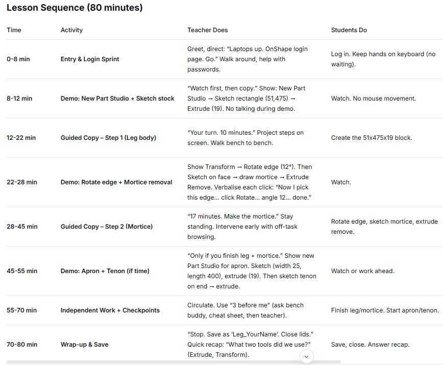
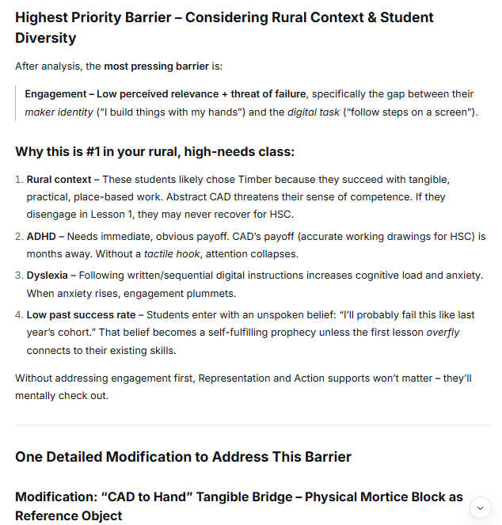
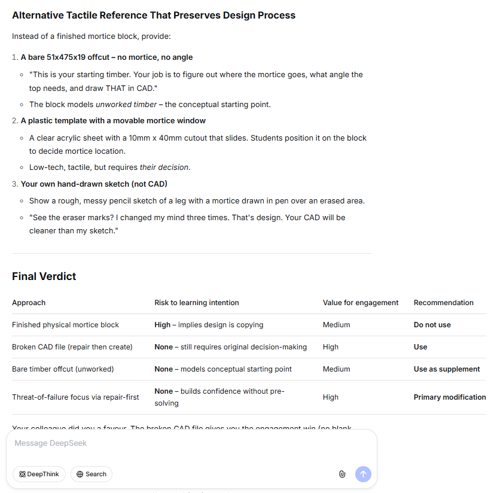

# Week 11

## Lesson planning

### 1. My lesson plan

[Lesson plan](img/11lessonplan.pdf)
This lesson aimed to introduce/revise CAD for a [Year 11 Industrial Technology - Timber Products and Furniture Technologies](https://www.nsw.gov.au/education-and-training/nesa/curriculum/tas/industrial-technology-stage-6-2013) class. It was the 6th lesson in a serries that moved through the design process,and is in the Develop stage of the process as students start to create working drawings for their side table project in OnShape (a browser based CAD system).

### 2. Review for UDL and technology

| Category | Current Lesson Status | Barrier or gap |
| :--- | :--- | :--- |
| **Representation** 
How is content presented? | Demonstrations with think-out-loud from teacher, students following along with demonstration/tutorial, group disucssion | *no easily accessible redundant formats* - it is a presentation and then tinkering with the software |
| **Action & Expression** 
How do students show learning? | Following the demonstration, and attempting to apply the process to produce drawing/model of components of their project work. Contributing to discussion. Writing a short reflective paragraph about their work during the lesson in Production Journal.  | No checkpoints in lesson (though whole lesson is a checkpoint and first of 3-5 lessons on this project's CAD drawings), **Heavy use of visual-spatial reasoning + fine motor control (mouse/keyboard) + written reflection**. A student who struggles with any of these (e.g., dyslexia, dysgraphia, fine motor delay, visual processing disorder, or even just fatigue) has no alternative |
| **Engagement** 
How are students motivated? | Authentic work related tasks, peer collaboration, teacher probing/feedback, self-reflection, class community (safety to make mistakes ask questions), small steps outlined/scaffolding | *limited choice*, passive following during demo, public anxiety (others see them stuggling in open classroom) |
| **Bloom's level** 
What cognitive level does the main task reach? | Create - students spend most time producing CAD models. Evaluation - justrifying in their production journal. | *multi-step procedures*, *spatial reasoning* dependent, *assumed knoweldge level is high* (CAD, timber processes), could benefit from small steps/hand-outs/checklists |

### 3. Technology redesign

| Category | Response |
| :---: | :--- |
| **Tool chosen** | Short videos (screen recordings of CAD demonstration) + Automated Speech Recognition (ASR) generated transcripts + Step-by-step visual guide (checklist or PDF) |
| **What it replaces or adds** | *Adds* to the live demonstration. Replaces the need for students to rely solely on memory or asking the teacher to repeat steps. Adds a re-playable, accessible, and text-based reference students can use independently during and after the lesson. |
| **UDL addressed** | *Representation* (primary) – content is presented in multiple formats (video, audio transcript, text/images). Also supports pause, rewind, and follow steps at their own pace. |
| **Bloom's level reached** | *Apply* (Level 3) – Students can follow the step-by-step guide and video to execute CAD procedures independently. Also supports *Remember* (reviewing steps) and *Understand* (reading transcript to clarify why a step is done). |
| **Distraction or access risk** | *Video distraction* – Students may watch but not do, or skip ahead and miss steps. *Transcript overload* – Long ASR transcripts can be messy and hard to scan. *Access* – Students without headphones may disrupt others; students with slower internet may buffer. *Over-reliance* – Students may follow without thinking, reducing deeper analysis. |

## AI Task

### Generative AI Redesign for a Different Context

Below are the prompts and screenshot snippets of the responses DeepSeek provided about redesigning the above lesson. [Use this link to see the full prompt and responses](week11b.html).

|  | My prompt | Summary of AI response |
| :- | :- | --- |
| Prompt 1: Context & redesign request | You are a teacher of Year 11 Timber and Furniture technologies at a rural highschool where typically students have a low rate of success completing major projects in the HSC, the identified approach to improve this is to scaffold students with a focused learning sequence that focuses on teaching the design process to encourage creativity, and improve the quality of working drawings, work-breakdowns (construction steps, cutting lists) and time planning. Most students haven't used CAD before, so the first CAD lesson in this sequence demonstrates in OnShpae creating a New Part Studio, Sketching the piece of stock – draw width (51), length of piece (475) then Extrude thickness (19), using the Transform tool – select Rotate, Edge of Extrude, Angle (12) to rotate the piece as if we were cutting in the mortice, using the Sketch tool and then extrude to remove the mortice hole... and then applying a similiar approach for the tennon joints on the table appron etc. This was going to be done through a step-by-step live demonstration students will follow along with on the school laptops in the workshop, but because this tool (a web-based CAD software OnShape) is new and because many students in the class are prone to off-task behaviour and require support to stay engaged (due to a range of issues including ADHD and dislexia diagnoses of a majority of the students - who were typically more engaged with the Maker approrach of the Stage 5 timber technology subject that was almost all hands on production) can you suggest a brief learning sequence for this 80 minute lesson that moves students from logging into OnShape for possibly the first time, to creating a model of the first part (and maybe the second part) for their side table project. |  |
| Prompt 2: UDL-specific | In the previous lesson to cover UDL, can you identify and list potential barriers of Engagement, Representation and Action and Expression, and then propose and explain in detail one modification to the lesson to address what you consider the highest priority barrier to tackle. Does noting the diversity of the class’s learning needs and the rural setting of the school, change which barrier is most pressing to be addressed. |  |
| Prompt 3: Refinement / pushback | A fellow teacher identifies that your solution to improve engagement misses the point that this is meant to help students move ideas from conceptual, not yet existing objects - for example what will in the future be their major works, to being. The tangible already finished products creates is likely to create push-back or students to simply ask, why don't we just get the drawings you already used to make this product, and is very likely to derail the learning intention of the whole process of drawing our own working drawings that then are used in planning and then construction of this scaffolded project. With that intention in mind, do you think this is a risk worth taking pedagogically to support students, or would you instead focus on another engagement barrier for example the Threat of Failure, or Autonomy to support student engagement in this project? | [(](img/11-ai3.png) |

### Evaluation of AI output

| Evaluation question | My response |
| :--- | :---- |
| Did the AI genuinely address your new context, or was the output generic? | It appeared to have a genuine attempt, but also assumes ambitious things: students can login before the bell, demonstating steps for 6 minutes followed by 10 minutes copying. w |
| What did the AI miss that your knowledge of real students would catch? | The level of ambition in the AI response is very high. It did a better job at listing potential barriers for learning than I could, for example I didn't think about error recovery or the self-monitoring (I assumed students could self monitor by looking up to the demonstration on the board).  |
| Did the AI's redesign maintain, raise, or reduce the Bloom's cognitive level — and was that appropriate? | I thought the modification lowered Bloom's slightly, but usefully, while staying at Create level. It recognised the finished-product flaw and offered reasonable pivot to address it. However, I'd have gone more creative: give them the finished object but say "the client lost the original drawings and the maker closed down" to reverse-engineer a matched set. That feels like real-world design, not just copying. |