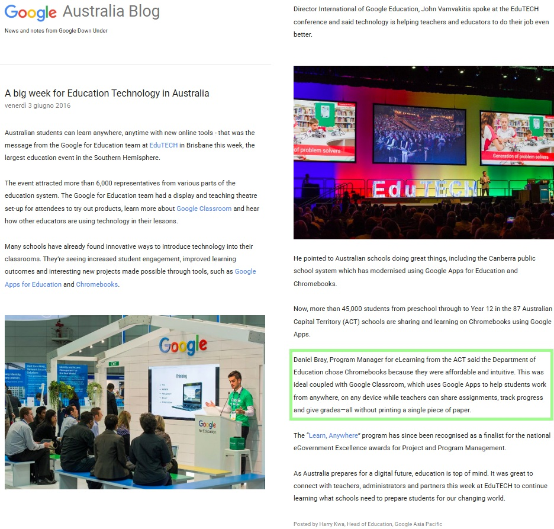

# Week 2

## Hype-to-Actual “Claim Check”

---

{: .note-title}
> “Chromebooks are affordable and intuitive… coupled with Google Classroom… help students work from anywhere, on any device while teachers can share assignments, track progress and give grades – all without printing a single piece of paper” [(Kwa, 2016).](https://australia.googleblog.com/2016/06/a-big-week-for-education-technology-in.html?hl=it)

This 2016 promise of a paperless classroom, enabled by affordable netbook devices and Google Classroom overlooks the practical realities of internet dependence and the cognitive limitations of digital notes. 
**The claim suggests that Chromebooks, coupled with Google Classroom, can facilitate a seamless, paperless learning environment where students can work from anywhere and teachers can manage assignments entirely digitally** (Kwa, 2016). This vision implies that a student's heavy backpack can be lightened, and a teachers homework and assignment logistical process can be streamlined by using netbooks and Google Classroom.
However, ICT is not a "one-fix-for-all" solution; its success depends on context, and ignoring subject-specific needs can disadvantage students (Sanders & George, 2017, p. 2922). A key constraint is that Google Classroom requires high-speed internet, so  **working "from anywhere" is only possible for some**, students without reliable home access must rely on public libraries or schools, increasing both the effort and cost required to participate. Furthermore, the shift to **a paperless format introduces practical difficulties** for learners, particularly when studying without hard copy notes (Sanders & George, 2017, p. 2928). **Tactile literacy strategies, such as underlining or writing in margins, are not intuitively susbstituted** in the digital classroom environment, often creating friction that requires downloading additional apps to perform simple tasks.
Ultimately, while the allure of a paperless classroom is strong, the common pitfall is presuming the medium itself is the solution, rather than first identifying the specific educational needs (Sanders & George, 2017, p. 2923). For the digital environment to be as reliable and cognitively effective as the paper-based classroom it replaces, the critical question remains: how do we ensure it is equitable and functional for all students?

{: .note-title }
> 
> iscreenshot of [2016 Google Blog by H. Kwa](https://australia.googleblog.com/2016/06/a-big-week-for-education-technology-in.html?hl=it)