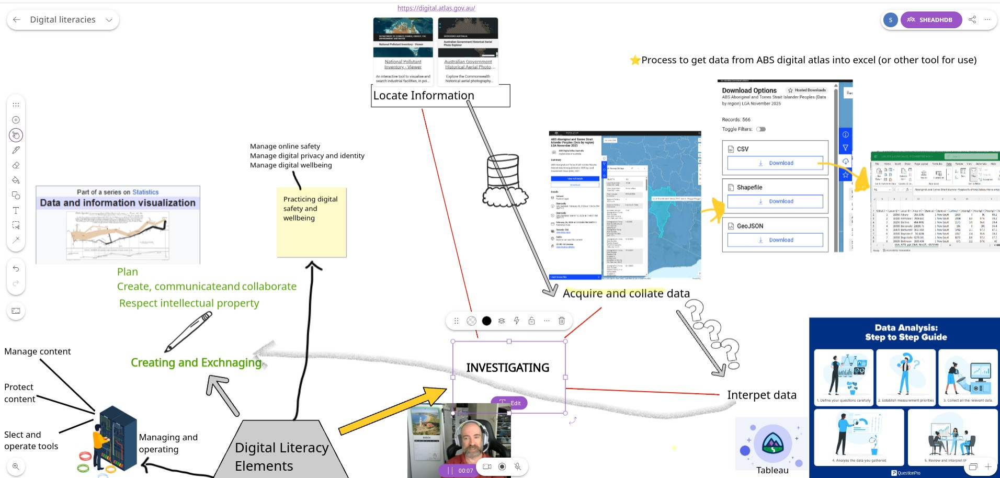

# Week 3

## Digital Literacy on a virtual whiteboard

Teaching digital literacy means equipping students to critically evaluate digital tools and use them to their full potential (ACARA, 2022b). Australia's rich open government data ecosystem provides an ideal foundation for this learning. Students can investigate resources like the [ABS Digital Atlas of Australia](https://digital.atlas.gov.au/), [data.gov.au](https://data.gov.au/), [National Archives of Australia](https://www.naa.gov.au/students-and-teachers/student-research-portal), [Australian War Memorial](https://www.awm.gov.au/advanced-search), or [ACMI](https://www.acmi.net.au/works/)).

As shown in my Explain Everything diagram, the process of obtaining data is only the first step. Real learning begins when students critically interrogate where numbers come from (ACARA, 2022b): Why is data grouped by local government areas rather than postcodes? Do figures derive from surveys, censuses, or statistical modelling? This shifts the lesson into general capabilities—critical thinking, ethical understanding, and recognising that concepts like "family" differ across communities (ACARA, 2022a).

Interpreting data adds complexity. When students analyse and communicate findings, they engage in "creating and exchanging," applying numeracy and productive literacy to transform data into shareable insights. Yet in an AI-driven world, this final step must go further: students need to analyse how tools operate, how they mislead, and how to create with them (Wyatt-Smith, 2024, p. 16).

<!--

Teaching digital literacy means giving students the skills to critically evaluate digital tools and use them to their full potential (ACARA, 2022b). In Australia, we are fortunate to have a rich ecosystem of open government data that serves as a perfect foundation for this learning.

When investigating and locating information, students can start with resources like the [ABS Digital Atlas of Australia](https://digital.atlas.gov.au/) (some others I can think of that are interesting include: [data.gov.au](https://data.gov.au/), [National Archives of Australia](https://www.naa.gov.au/students-and-teachers/student-research-portal), [Australian War Memorial](https://www.awm.gov.au/advanced-search), or [ACMI](https://www.acmi.net.au/works/)). 

In the Explain Everything diagram (above) I started to outline in screenshots and a short video explaining the process for obtaining data from the ABS Digital Atlas. But real learning begins when students move beyond acquisition to critically interrogate where the numbers come from (ACARA, 2022b). They must question why data is grouped by local government areas rather than statistical areas, why boundaries ignore postcodes, and whether figures derive from surveys, censuses, employer reports, or statistical modelling. This shifts the lesson from basic literacy into the general capabilities: critical and creative thinking, ethical understanding, and intercultural understanding—recognising, for example, that concepts like "household" or "family" differ across communities (ACARA, 2022a).

Interpreting data adds another layer of complexity. When students analyse and communicate their findings, they engage in the "creating and exchanging" element of digital literacy, applying numeracy and productive literacy to turn collated data into shareable insights. Selecting the right platform to communicate those insights is the final step. Yet in an AI-driven world, this step must go further: students also need to analyse how these tools operate, how they can mislead, and how to create with them (Wyatt-Smith, 2024, p. 16).
-->

