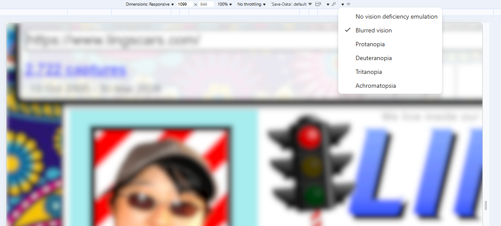
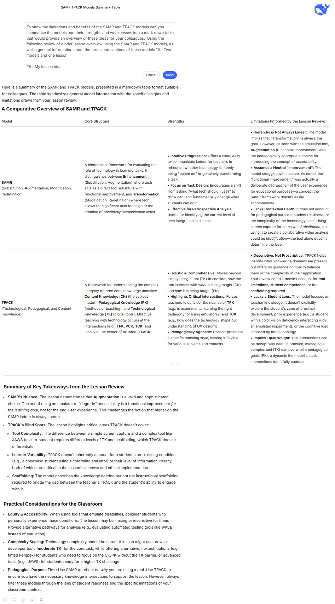

# Week 4

## Two models and one lesson

### My lesson idea

Students use [browser developer tools](https://learn.microsoft.com/en-us/microsoft-edge/devtools/accessibility/reference) to emulate vision deficiencies, slow internet, and small screens, recording difficult-to-navigate website components for further investigation/discussion. This introduces practices for evaluating computer-based technologies (P6.2) and considerations for communicating ideas (P5.2) in Year 11 Design and Technology (NESA, 2013). 

{: .note-title }
> 
> Screenshot of vision impairement emmulation options in [Edge](https://learn.microsoft.com/en-us/microsoft-edge/devtools/accessibility/emulate-vision-deficiencies)

### Model 1: SAMR

* The emulation is an example of **augmentation** – functional "improvement" to experience browsing with vision impairment. Using screen capture or similar tools for observations – is **substitution** of sketches and notes, or **modification** if video is captured. 
* It is Interesting how augmentation here is a degradation of accessibility. 
 
### Model 2: TPACK

* **Technical knowledge** is using the browser emulation, and record keeping apps. Students will need to understand features, to use emulator parameters, as well as screen capture to record observations. **Content knowledge** crosses over with technical knowledge as it includes UX and website navigation. **Pedagogical knowledge** covers experimental learning, critical analysis.
* TPACK doesn't account for complexity levels of tools, tool limitations, or assessing scaffolding required/used. Student level or thinking, or their competence/experience (i.e. information literacy or previous theoretical understanding) isn't explored.

### What might this look like in a real classroom? 

* In a better-equipped classroom, additional tools like text-to-speech systems ([JAWS](https://en.wikipedia.org/wiki/JAWS_(screen_reader))) or [braille reader peripherals](https://en.wikipedia.org/wiki/Refreshable_braille_display) could be used, but that increases the complexity for both students and facilitator. Alternative tiers for below/above standard students focuses on capturing user experiences and evaluating automated testing by comparing [WAVE scores](https://wave.webaim.org/) with their observations.
* It is likely some students have a colour vision deficiency - limiting the pedagogical value of the activity, or making the task unnecessarily difficult or overwhelming by laying an emulated impairment on top of their condition. 
* **No/low-tech alternatives** include [foggles](https://www.aopa.org/news-and-media/all-news/2020/september/flight-training-magazine/what-am-i-view-limiting-device) (used by student pilots) to emulate restricted visibility, and tinted Perspex or coloured lights to reduce visibility by [collapsing colour differentiation](https://phys.libretexts.org/Courses/Fresno_City_College/NATSCI-1A%3A_Natural_Science_for_Educators_Fresno_City_College_(CID%3A_PHYS_140)/11%3A_Electromagnetic_Radiation/11.05%3A_Light_Color_and_Perception). Viewing posters or signage under these conditions approximates but doesn't realistically emulate a vision impairment.

## AI summary task
{: .note-title }
> 
> Composite screenshot of promt and [DeepSeek V3](https://deepseek.com/en/) response.
<!-- (https://github.com/deepseek-ai/DeepSeek-V3) -->

