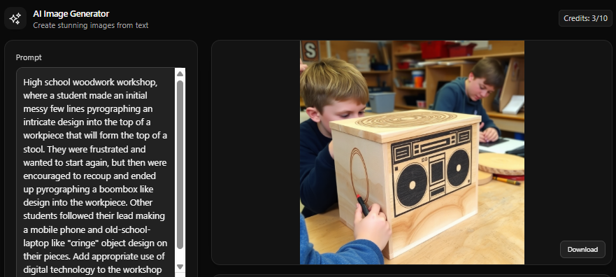
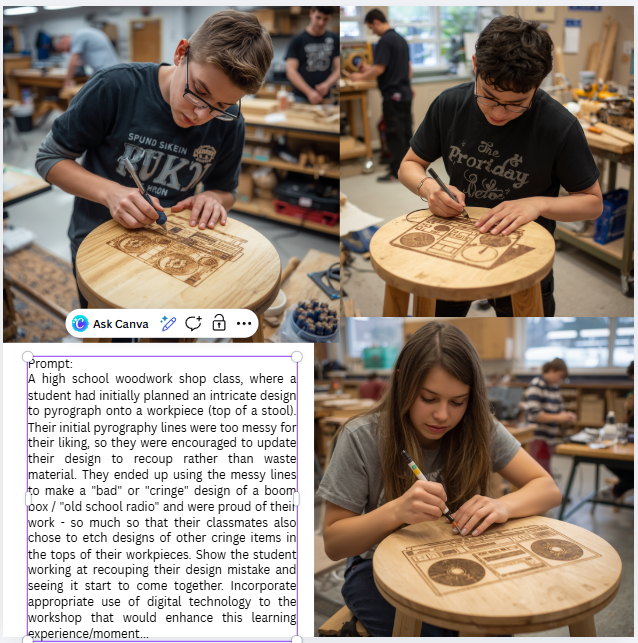

# Week 5

# Constructivist classroom

Comic

Once you have completed your comic, post it to your ePortfolio, including a brief explanation of how your comic illustrates your constructivist classroom, and justifying your approach in the classroom. (150-200 words maximum.)
Remember to include references to the readings (and any other literature you've drawn on) in your writing. 

Part B

In the text of your comic, explain what sort of pedagogical approach is being used in your illustration/s. Are we seeing a behaviourist, cognitive, constructivist, and/or social constructivist approach?

Is there a digital technology that could be used to achieve this approach? Or if you used technology, would a different pedagogy be useful? For example, students in a mathematics class might be using counters on a table in a group, but if they were using a counting game on an iPad, what would change? Who would benefit (or not)?

What would be the issues you would have to consider when choosing a digital tool for this purpose? (For example, student tracking, biases, distractions, social learning, etc.)

AI task

AI image of the situation in the comic using Canva AI image generator
