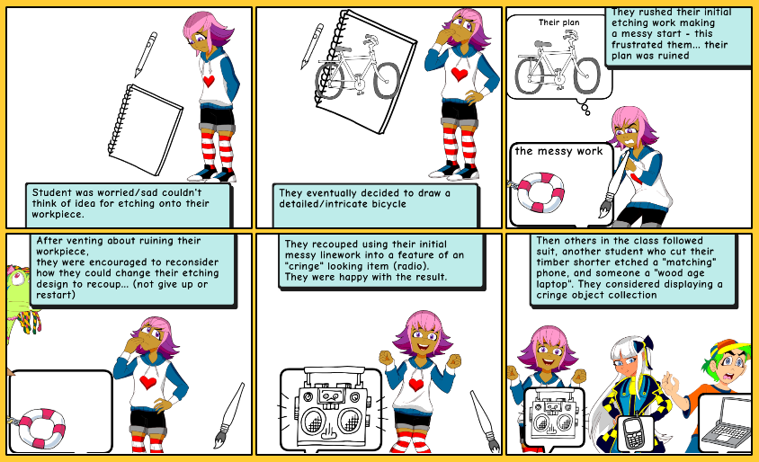

# Week 5

## Constructivist classroom comic
{: .note-title }
>
> 
> Made using [https://makebeliefscomix.com/Comix/](https://makebeliefscomix.com/Comix/)

The student’s journey in my above comic mirrors a constructivist pedagogy approach, where learning emerges through doing, reflecting, and adapting. In this class the student was initially worried about having no design idea, then chooses an technically detailed bike pattern, reflecting autonomy. When the first geometric shape didn’t turn out as intended, they felt defeated. Where I (the teacher) briefly intervened by encouraging the student to work with the mistake instead of providing a timber project. This small prompt creates a condition for self-discovery, as the student reconsidered their design and played with having to keep the project, making it a “cringe” radio/boombox item they weren’t really interested in initially. The student ultimately found satisfaction, and this strange, ironic motif spreads to others adapting their designs to be “wood-aged” phones and laptops, demonstrating how knowledge is co-constructed socially. As Bower (2017) summarises, constructivist educators facilitate reflection and challenge misconceptions rather than deliver facts. My light touch teaching, questioning without rescuing, exemplified this. Alternative labels could include constructionism (making tangible artifacts) or socio-cultural learning (peer influence), but the core aligns with constructivist facilitation over knowledge transmission. 

## Part B

Digital technology typically undermines the cabove constructivist moment because it offers undo, erase, and reset functions. In pyrography, mistakes are permanent—forcing the student to adapt and reflect. Haptic woodworking simulations remain cost-prohibitive, awkward to use, and overly complicated compared to real-life woodworking.

However, a constrained digital environment like Minecraft could work for younger students—if creative mode is disabled or block-breaking is limited. A student who makes a placement or design choice mistake cannot delete it must then incorporate the error, enabling constructivist reflection and peer co-construction. The key is designing limitation into the tool. Without that, technology defaults to erasure rather than adaptation, losing the pedagogical value entirely.

## AI Task

{: .note-title }
> 
> 
> This is an attempt to get an AI image generator to create an image of the above situation using [Canva](https://www.canva.com/ai-image-generator/)
>
> Canva’s AI image generator failed to produce usable classroom scenes. It omitted students in 60% of outputs, ignored prompts about digital technologies or personalised learning, and required twenty attempts to show a student with a messy design. Adding or rewording instructions produced no noticeable change.
