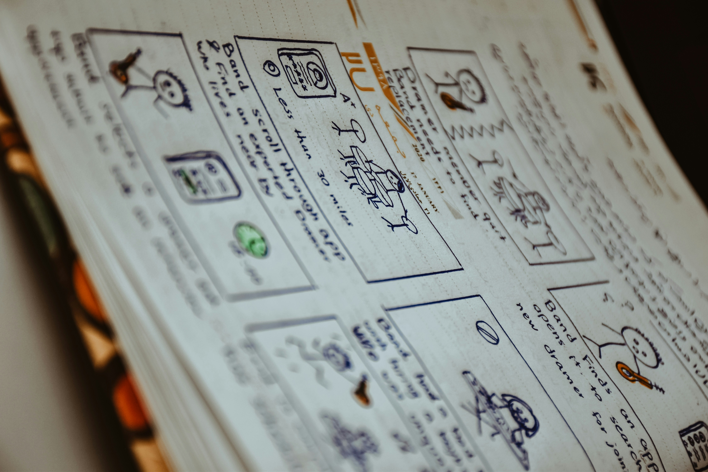
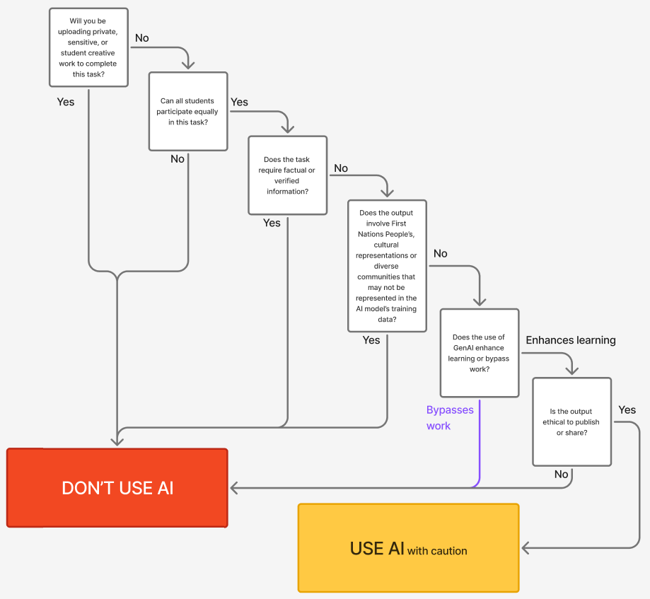

# Week 6

## **Decision Note:** Using GenAI to Mark a Design Portfolio

**Context:** Stage 5 Design and Technology – marking student design portfolios against an assessment rubric to provide feedback.

### **Decision:** _Don’t use_

**Reasoning:** While marking is time-consuming and quicker feedback would benefit students, the risks identified below cannot be safely mitigated.

**Risk 1 –Duty of Care & Privacy**: I do not have explicit permission to share student work with genAI services. Design portfolios often contain original concepts, images, and personal reflections, making this a significant privacy and potential copyright breach.
**Safeguard _(insufficient🚨)_**: Anonymising names would not protect the original creative content itself, which remains student intellectual property.

**Risk 2 – Equity & Truth**: GenAI has biases and lacks contextual understanding of what was actually taught in class. It cannot accurately interpret the intended outcomes or acceptable standards for a specific design task. Truth is central, marks and feedback must be clearly linked to the work presented, not to a generic AI pattern.
**Safeguard _(insufficient🚨)_**: Even with full human verification, using AI to draft marks introduces potential bias at the draft stage, and the time saved would be lost in intensive cross-checking.

**Final decision**: Given unresolved privacy and intellectual property risks and the fundamental need for context-accurate, defensible marking, **I would not recommend genAI for marking student design folios**. Marking remains my professional responsibility.

Image by [Nasim Keshmiri](https://unsplash.com/@nasimkeshmiri) on [Unsplash](https://unsplash.com/photos/a-close-up-of-a-book-with-writing-on-it-nZWgjwlCk3I)

## Tiny Artifact

Flowchart made using [Figma](https://www.figma.com/)

## Gen AI Task: "Minimum Ethical Use conditions"

Created using [Replit](https://replit.com/) - using the following linked [prompt](week6b.html)
