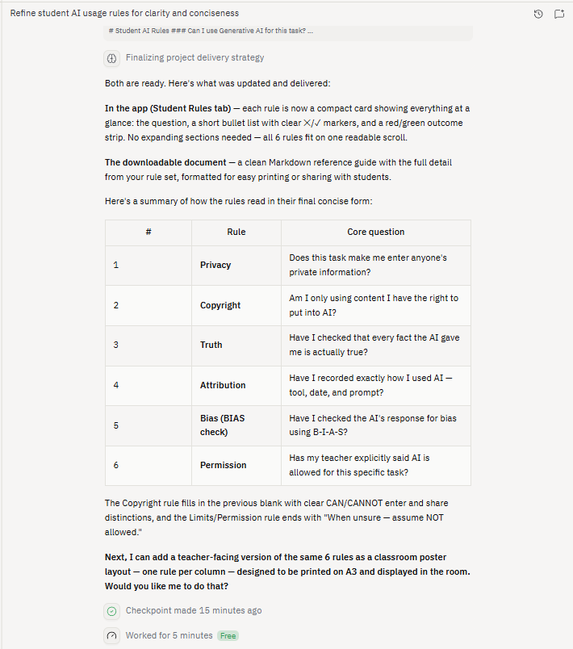

# Week 6 AI task Prompt

>Based on the rule set - "• No sensitive info rule (what must never be entered)• Student names, ID numbers, or any personally identifiable information (PII)
>• Biometric data (fingerprints, facial recognition data, voice samples)
>• School name, specific location, or class timetables
>• Student work containing other students' names or personal details
>• Teacher assessment notes about specific student behaviours or needs
>• Copyright/publishing rule (what can/can't be shared)
>Input – What you can enter into AI:
>• Your own original work that you hold copyright to
>• Publicly available texts (e.g., out-of-copyright literature, government publications)
>• De-identified examples you have explicit permission to use
>• Short quotes for analysis (under fair dealing/fair use)
>Input – What you cannot enter into AI:
>• Published textbooks, worksheets, commercial exam papers, or teacher-created resources you do not own or have permission to reproduce
>• Student work (including drafts, portfolios, or reflections) without explicit written consent from the student and parent/carer
>• Indigenous Cultural and Intellectual Property (ICIP), First Peoples' knowledges, or culturally sensitive material (e.g., stories, art, ceremonies, ancestral names)
>• Copyrighted images, song lyrics, film scripts, or artwork
>• Materials with an "All Rights Reserved" notice unless you are the rights holder
>Output – What you can publish or share from AI:
>• AI-generated text that you have fact-checked, edited, and clearly attributed
>• Ideas or structures generated by AI that you have transformed substantially
>Output – What you cannot publish or share from AI:
>• Raw, unverified AI output presented as your own work or as factual truth
>• AI output that reproduces copyrighted material (AI may memorise and repeat fragments of books, articles, or code)
>• AI output that mimics or appropriates Indigenous cultural expressions without permission and proper attribution
>• AI output containing student names, school details, or other sensitive data (even if generated mistakenly by the AI)
>When in doubt: Assume you cannot share it. Ask your teacher.
>• Truth rule (what must be verified and how)
>• All factual claims generated by AI must be verified against a trusted primary or secondary source
>• Any AI-generated fact that cannot be verified within 5 minutes must be labelled "Unverified – AI generated"
>• Numerical data, dates, and quotations require double-checking (AI commonly invents these)
>• Final submitted work must clearly distinguish between human-verified facts and AI-generated text
>• Attribution rule (how students and teachers acknowledge AI use)
>• Students and teachers must cite AI use including: Tool name (e.g., ChatGPT 4o, Microsoft Copilot), date of generation, and the full prompt(s) used
>• If AI content is modified, state: "Generated by [tool], then edited by [name]"
>• For collaborative AI use (e.g., brainstorming), note: "AI assisted in generating ideas only – final writing is my own"
>• Bias check rule (what to look for and what to do if found)
>• Behind the text: Who created the training data? What perspectives might be missing?
>• Implicit assumptions: What does the AI assume about "good writing," "normal situations," or "correct answers"?
>• Alternatives: Can you generate a version that centres a different perspective?
>• Swap test: Change a name, place, or pronoun – does the output stay consistent?
>• What to do if bias is found: Annotate the bias in your submission, generate a counter-perspective version, and discuss with your teacher before using any biased output
>• Limits rule (when AI is allowed vs. not allowed)
>• Allowed use: Brainstorming ideas, drafting sentence structures, checking grammar, summarising known information, generating practice questions, explaining concepts you already understand
>• Not allowed use: Writing final assessed responses, generating claims you cannot verify, completing take-home exams, substituting for your own thinking, creating first drafts of reflections or personal narratives
>• Teacher discretion zone: Group work, peer feedback drafts, creative writing – always check individual task instructions
>• When unsure: Assume "not allowed" unless the teacher has given explicit written permission for that specific task
>" Can you improve/rewrite them it to be a short 6 question - 6 questions with minimum expansion so they can be a quickly read set of rules for students to use to select if they can use Generative AI for a class task - fill in the blanks with evidence based recommendations, and keep the language suitable for a Stage 3/4 student.

